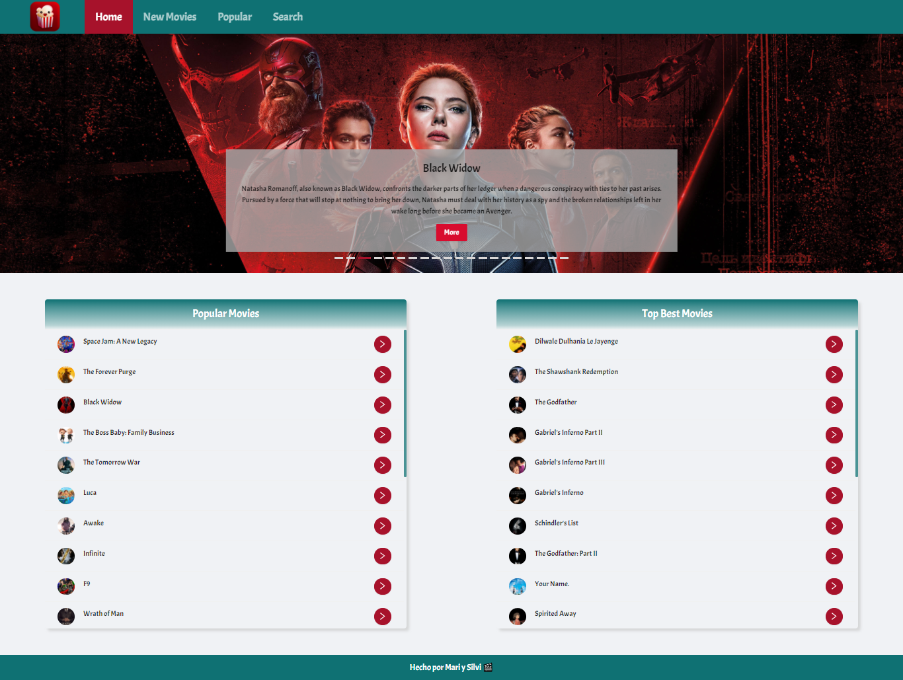

# ***Movie App by Silvi y Mari 🎬🎥***

## Aplicación desarrollada con [React](https://es.reactjs.org/) para realizar búqueda de películas, y tener la información de las mismos utilizando la API Rest de [The Movie Database](https://www.themoviedb.org/).
 

## Haciendo click [acá]() podrás verlo andar y buscar la infomación de tus películas favoritas!🍿🎬🎥

### 📍***Este proyecto utiliza las siguientes dependencias:***
📁 [React Router](https://reactrouter.com/)

📁 [TMDB](https://www.themoviedb.org/)

📁 [Ant Design](https://ant.design/)

📁 [Moment.js](https://momentjs.com/)

📁 [React-player](https://github.com/CookPete/react-player)

📁 [Sass](https://sass-lang.com/dart-sass)

